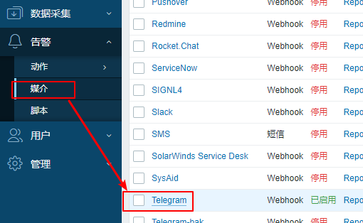
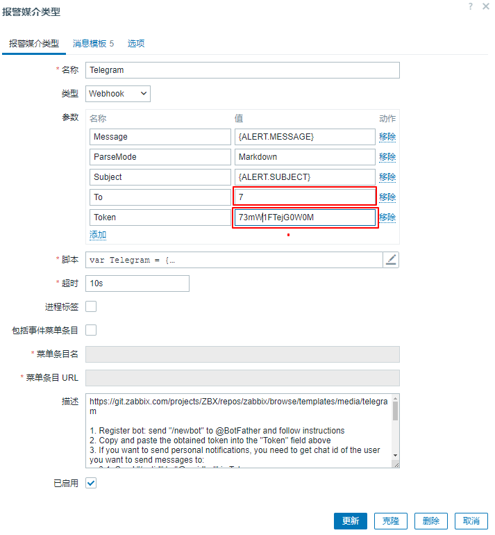
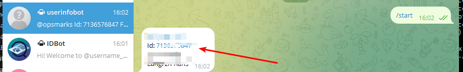
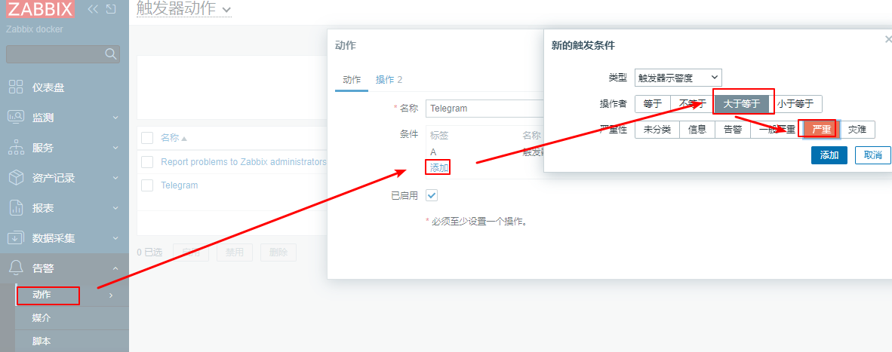
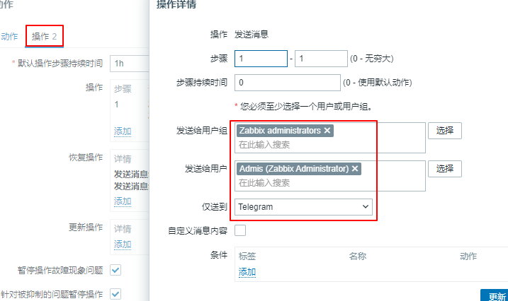
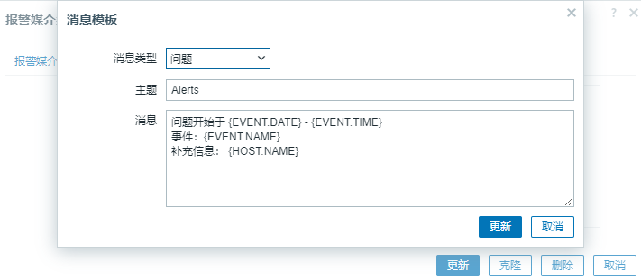
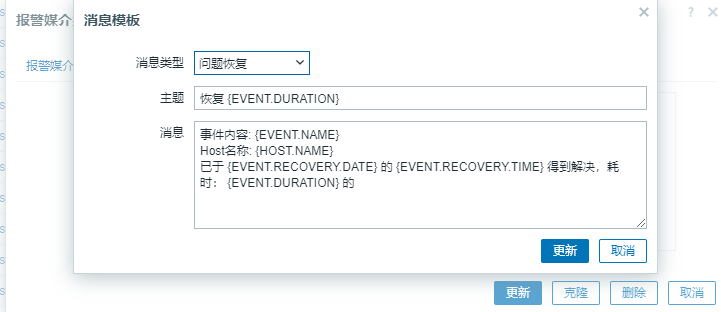
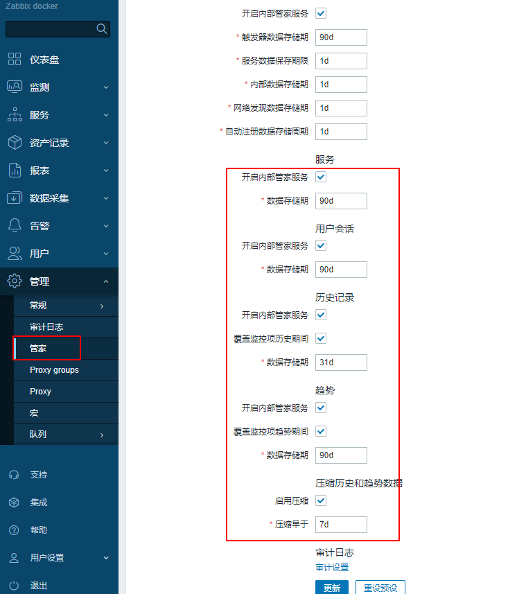

## 0.安装

| ID   | Name                   | version     |
| ---- | ---------------------- | ----------- |
| 1    | timescaledb            | 2.14.2-pg16 |
| 2    | zabbix-web-nginx-pgsql | 7.0.0-lts   |
| 3    | zabbix-server-pgsql    | 7.0.0-lts   |

see [7.0](zabbix_server/docker_zabbix_server-timescaledb/7.0)目录下的docker-compose文件，你必须安装docker和docker-compose

## 1.sed to telegram

you see [create-telegram-chatbot](https://sendpulse.com/knowledge-base/chatbot/telegram/create-telegram-chatbot) .

确保你创建了tg bot，获取到了token。假如你忘记了token，仍然可以通过[BotFather](https://t.me/botfather)，输入/token选择bot重新获取

1,修改媒介



如下：




### 1.1 获取chatid

```
TO： 发送的对象，可以是个人，也可以是群组，需要获取到个人或者群组的id
Token： 创建机器获取的token
```

- 个人chatid

获取个人chatid , open [userinfobot](https://t.me/userinfobot)



- 群组chatid

获取群组id

经过几个小时的努力，我发现了以下有效的顺序：

假设机器人名称是**my_bot**。

**1- 将机器人添加到群组。**
转到群组，单击群组名称，单击添加成员，在搜索框中搜索您的机器人，例如：@my_bot，选择您的机器人并单击添加。

**2- 向机器人发送一条虚拟消息。**
您可以使用此示例：（`/my_id @my_bot`
我尝试了几条消息，但并非所有消息都有效。上面的示例工作正常。也许消息应该以 / 开头）

**3- 转到以下网址：** `https://api.telegram.org/botXXX:YYYY/getUpdates`
将 XXX:YYYY 替换为您的机器人令牌

获取到后，点击test即可。

### 1.2.配置动作








### 1.3.消息模板

问题



```
Alerts
问题开始于 {EVENT.DATE} - {EVENT.TIME}
事件：{EVENT.NAME} 
补充信息： {HOST.NAME}
```

问题恢复



```
事件内容: {EVENT.NAME}
Host名称: {HOST.NAME}
已于 {EVENT.RECOVERY.DATE} 的 {EVENT.RECOVERY.TIME} 得到解决，耗时： {EVENT.DURATION} 的
```


zabbix 7.0.0支持的最高版本是2.14

timescaleDB版本矩阵: https://docs.timescale.com/self-hosted/latest/upgrades/upgrade-pg/

docker会默认创建库和sql,见[docker-entrypoint.sh](https://github.com/zabbix/zabbix-docker/blob/7.0/Dockerfiles/server-pgsql/alpine/docker-entrypoint.sh#L345)，否则参考[zabbix install timescaledb](https://www.zabbix.com/documentation/current/en/manual/appendix/install/timescaledb)

## 2. 时区

时区需要修改Php.ini文件打开配置，而dockerfile中没有开启的变量，因此映射文件到容器内覆盖原有配置即可

## 3.zabbix数据保留

只需要在zabbix ui配置了管家服务即可



### 3.1 timescaledb数据保留

配置了web ui，不需要在额外配置。以下仅供参考

see [add_retention_policy](https://docs.timescale.com/api/latest/data-retention/add_retention_policy/#sample-usage) or see [create-a-retention-policy](https://docs.timescale.com/use-timescale/latest/data-retention/create-a-retention-policy/)

在zabbix的sql文件中，有一个sql函数是zbx_ts_unix_now，他的作用是将时间转换为时间戳clock字段。假设我们想保留45天的数据

```
-- 设置保留天数
DO $$
DECLARE
    retain_days INTEGER := 45;
    current_time BIGINT;
    cutoff_time BIGINT;
BEGIN
    -- 获取当前时间戳
    SELECT zbx_ts_unix_now() INTO current_time;

    -- 计算保留时间的截止时间戳
    cutoff_time := current_time - (retain_days * 86400);  -- 86400 秒为一天

    -- 删除超出保留时间范围的数据
    EXECUTE format('DELETE FROM history WHERE clock < %L', cutoff_time);

    RAISE NOTICE 'Data older than % days deleted successfully', retain_days;
END $$;
```


查看数据的结构

```
VM:/var/lib/zabbix# find / -name *.sql
/usr/share/doc/zabbix-server-postgresql/option-patches/with-compression/history_upgrade.sql
/usr/share/doc/zabbix-server-postgresql/option-patches/with-compression/history_upgrade_log.sql
/usr/share/doc/zabbix-server-postgresql/option-patches/with-compression/history_upgrade_prepare.sql
/usr/share/doc/zabbix-server-postgresql/option-patches/with-compression/history_upgrade_str.sql
/usr/share/doc/zabbix-server-postgresql/option-patches/with-compression/history_upgrade_text.sql
/usr/share/doc/zabbix-server-postgresql/option-patches/with-compression/history_upgrade_uint.sql
/usr/share/doc/zabbix-server-postgresql/option-patches/with-compression/trends_upgrade.sql
/usr/share/doc/zabbix-server-postgresql/option-patches/without-compression/history_upgrade.sql
/usr/share/doc/zabbix-server-postgresql/option-patches/without-compression/history_upgrade_log.sql
/usr/share/doc/zabbix-server-postgresql/option-patches/without-compression/history_upgrade_prepare.sql
/usr/share/doc/zabbix-server-postgresql/option-patches/without-compression/history_upgrade_str.sql
/usr/share/doc/zabbix-server-postgresql/option-patches/without-compression/history_upgrade_text.sql
/usr/share/doc/zabbix-server-postgresql/option-patches/without-compression/history_upgrade_uint.sql
/usr/share/doc/zabbix-server-postgresql/option-patches/without-compression/trends_upgrade.sql
/usr/share/doc/zabbix-server-postgresql/timescaledb.sql
```

see 

```
VM:/var/lib/zabbix# cat /usr/share/doc/zabbix-server-postgresql/option-patches/with-compression/history_upgrade.sql
\set ON_ERROR_STOP on

\copy (select * from history_old) TO '/tmp/history.csv' DELIMITER ',' CSV;

CREATE TEMP TABLE temp_history (
	itemid                   bigint                                    NOT NULL,
	clock                    integer         DEFAULT '0'               NOT NULL,
	value                    DOUBLE PRECISION DEFAULT '0.0000'          NOT NULL,
	ns                       integer         DEFAULT '0'               NOT NULL
);
.....
```

这里clock的时间戳是秒

```
zabbix=# SELECT * FROM history LIMIT 10;
 itemid |   clock    |         value         |    ns     
--------+------------+-----------------------+-----------
  23256 | 1720245696 |                     0 | 752022493
  28536 | 1720245696 |                     0 | 752073229
  23257 | 1720245697 |    2.5162337662337664 | 753230547
  45517 | 1720245697 |                     0 | 753183271
  23258 | 1720245698 |                     0 | 754359647
  28538 | 1720245698 |                     0 | 754372430
  45518 | 1720245698 |                     0 | 754308021
  23259 | 1720245699 |    0.7936507936507936 | 755496562
  23260 | 1720245700 |                     0 | 756656390
  23620 | 1720245700 | 0.0008303673560084145 | 756737807
(10 rows)
```

因此我们添加保留策略

```
添加保留策略
SELECT add_retention_policy('history', drop_created_before => INTERVAL '45 days');
SELECT add_retention_policy('history_uint', drop_created_before => INTERVAL '45 days');
SELECT add_retention_policy('history_log',drop_created_before => INTERVAL '45 days');
SELECT add_retention_policy('history_str', drop_created_before => INTERVAL '45 days');
SELECT add_retention_policy('history_text', drop_created_before => INTERVAL '45 days');
SELECT add_retention_policy('trends', drop_created_before => INTERVAL '45 days');
SELECT add_retention_policy('trends_uint',drop_created_before => INTERVAL '45 days');
```

添加完成后查看

```
SELECT j.hypertable_name,
       j.job_id,
       config,
       schedule_interval,
       job_status,
       last_run_status,
       last_run_started_at,
       js.next_start,
       total_runs,
       total_successes,
       total_failures
  FROM timescaledb_information.jobs j
  JOIN timescaledb_information.job_stats js
    ON j.job_id = js.job_id
  WHERE j.proc_name = 'policy_retention';
```

## 4.修改logo

与之前版本不同，7.0是存放在样式里面`/usr/share/zabbix/assets/styles/blue-theme.css`，将图片转换为base64

```
.zabbix-logo {
  width: 114px;
  height: 30px;
  background: url(
  "data:image/png;base64,iVBORw0KGgoAAAANSUhEUgAAAF4AAAAWCAIAAADGu7w4AAAACXBIWXMAAA7EAAAOxAGVKw4bAAAAEXRFWH
  background-size: contain; }

.zabbix-logo-sidebar {
  width: 91px;
  height: 24px;
  background: url('data:image/png;base64,iVBORw0KGgoAAAANSUhEUgAAAHIAAAAbCAIAAAAvREy4AAAACXBIWXMAAA7EAAAOxA
  background-size: contain; }

.zabbix-logo-sidebar-compact {
  width: 24px;
  height: 24px;
  background: url("data:image/svg+xml;base64,PHN2ZyB4bWxucz0iaHR0cDovL3d3dy53My5vcmcvMjAwMC9zdmciIHdpZHRoPS
```

